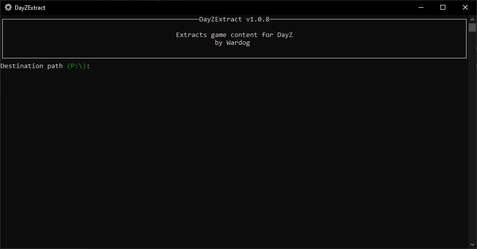
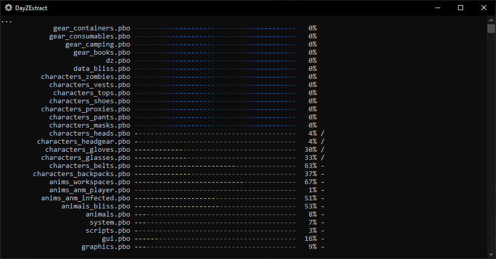
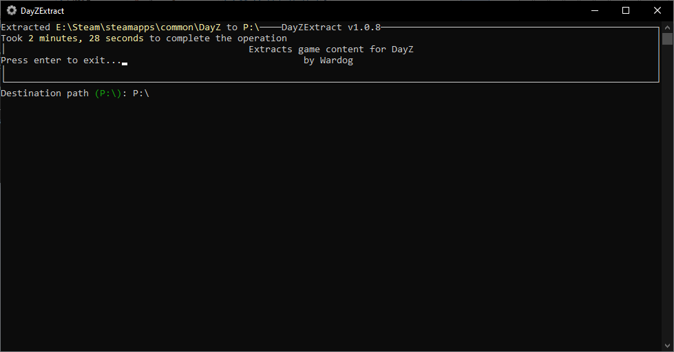

# [DayZExtract](#dayzextract)

[DayZExtract](https://github.com/wrdg/DayZExtract) is a tool created by [Wardog](https://github.com/wrdg) as an faster alternative to [Dayz Tools](dayztools.md) game data extraction

## [Usage](#usage)

1.  Go to [DayZExtract](https://github.com/wrdg/DayZExtract/releases) and download the latest _.MSI_ version.
1.  Install the tool.
1.  **Make sure [Dayz Tools](dayztools.md) is running and the P:\\ drive is mounted.**
1.  Start DayzExtract from the start menu or your desktop.
1.  It should look like this.
1.  
1.  Press enter, the program already default the exctration to the P:\\ drive
1.  
1.  