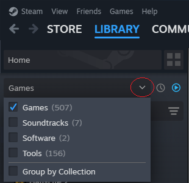
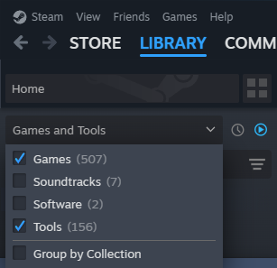
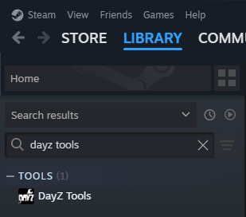
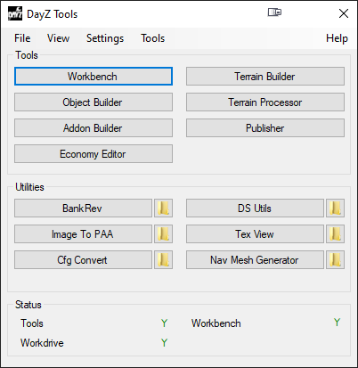
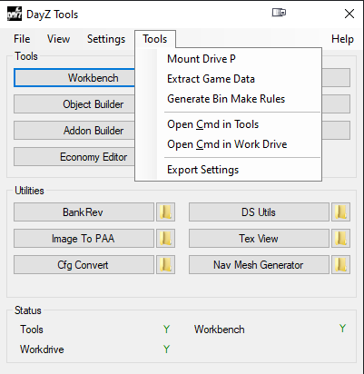
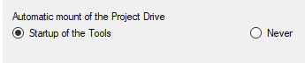

# [Dayz Tools](#dayz-tools)

[Dayz Tools](https://store.steampowered.com/app/830640/DayZ_Tools/) is a tool created by by Bohemia for Dayz Modders. It's the bare minimum to create and publish your mod.

## [Finding Dayz Tools inside Steam](#finding-dayz-tools-inside-steam)

1.  Open your steam and go to your library.
1.  Click on the arrow to open filter options.
1.  
1.  Tick the Tools filter
1.  
1.  Search for Dayz Tools
1.  

## [The P Drive](#the-p-drive)

1.  Start the tool from steam.
1.  
1.  Go to **Tools** and click **Mount Drive P**.

*   
    *   You need to mount the P drive everytime you will pack your mod.
    *   You can also go to **Settings** and change it to always mount the P drive when you open Dayz Tools.
    *   

## [BankRev](#bankrev)

You can use BankRev to unpack mods and see how other people made something. It will not work with mods that have been obfuscated with third-party tools.

## [Tex View](#tex-view)

You can open a .paa file to see the texture as a image. You can also save the texture as a image using Tex View by simple going to **File > Save as** and changing .paa to .png. You can also do the inverse, open the texture image and go to **File > Save as** and change the image texture to .paa.

## [Publisher](#publisher)

This is where you will upload your finished/updated mod to the steam workshop.