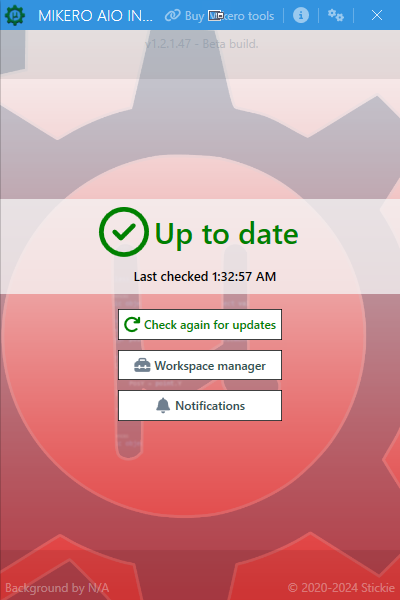
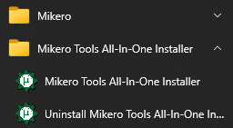
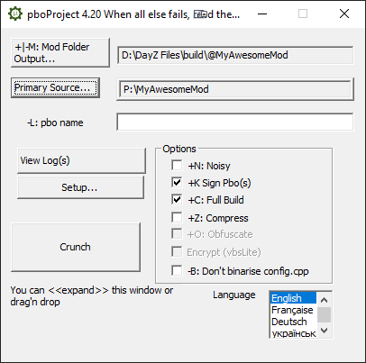
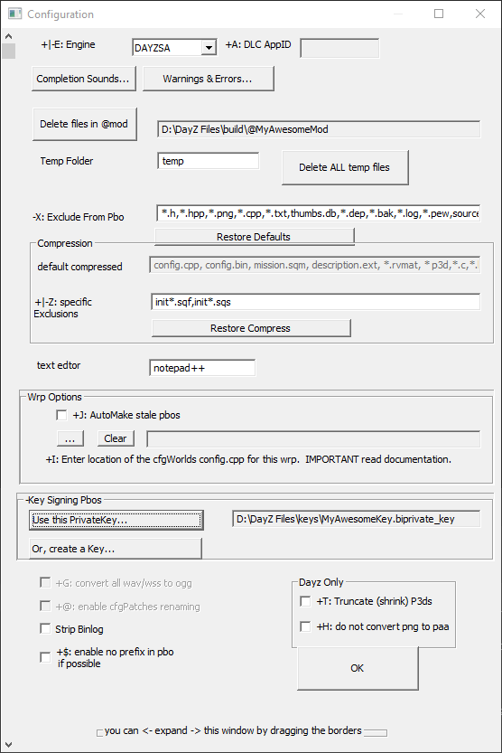
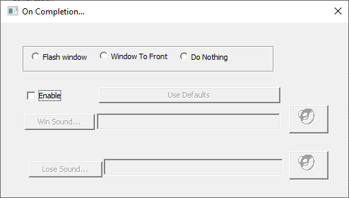

# [Mikero's Tools](#mikeros-tools)

[Mikero's Tools](https://mikero.bytex.digital) is a third party toolset to help you build your mod. It have both free and paid functions but the free version is enough to build your mod.

## [Download](#download)

1.  Go to [Download Page](https://mikero.bytex.digital/Downloads).
2.  Download **Mikero\_AiO\_Installer**.
3.  Install and run the AiO.
4.  The AiO will install/update all the tools.
5.  
6.  The tools will be accessible in the folder **C:\\Program Files (x86)\\Mikero\\DePboTools\\bin** or on your start menu in the mikero category.
7.  

## [pboProject](#pboproject)

pboProject is the tool that we will use to pack our mods. 

### [Setting pboProject up](#setting-pboproject-up)

1.  **Make sure [Dayz Tools](dayztools.html) is running and the P:\\ drive is mounted.**
2.  Click the Setup button.
3.  
4.  Change **+|-: Engine** to **DAYZSA**
    *   You can disable the complete/error sound in the button **Completion Sounds...**
    *   
5.  Click **Restore Defaults** and **Restore Compress**
6.  Select or create your private key
    *   If you need to create a key click **Or, create a Key...**, delete the entire name and type the name your key will have. It can be anything.
7.  Click **Ok**.
8.  Enable **+K Sign Pbo(s)**, **+C: Full Build**
9.  This should be the basic setup to pack your mod for testing and release.