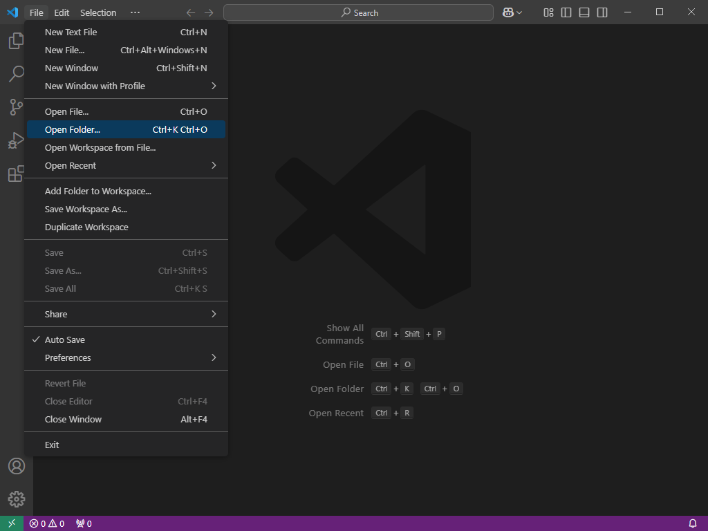
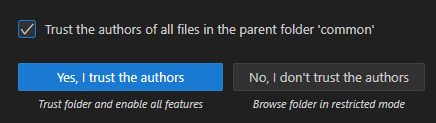
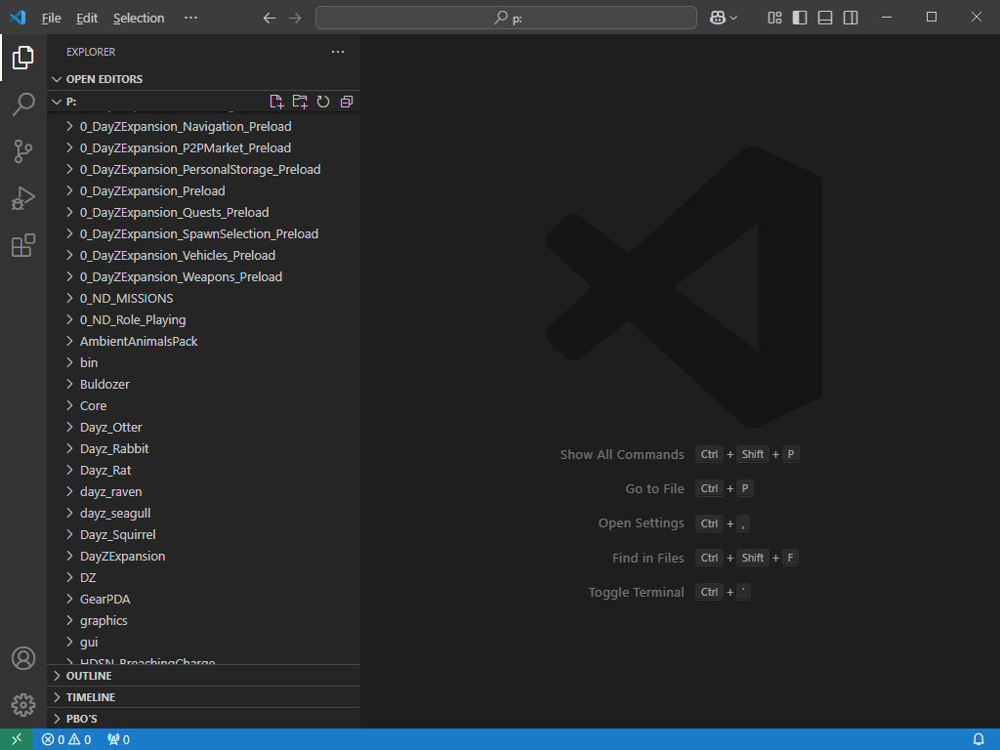
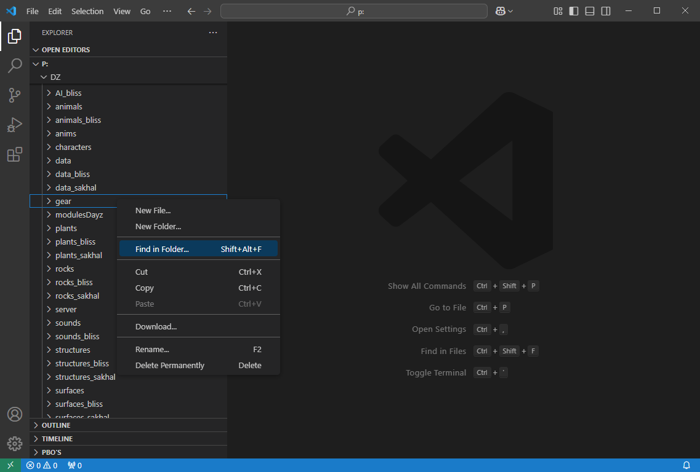
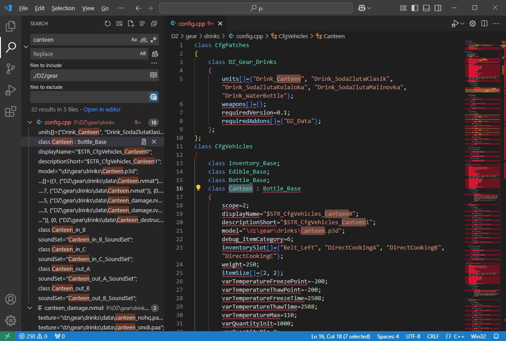

# [VSCode](#vscode)

[Visual Studio Code](https://code.visualstudio.com/) is a third party text editor to help you build your mod. It can help you find things in the unpacked DayZ/other mods code.

## [Download](#download)

1.  Go to [Visual Studio Code](https://code.visualstudio.com/) page.
1.  Download the installer.
1.  Install and run.

## [Usage](#usage)

1.  **Make sure [Dayz Tools](dayztools.md) is running and the P:\\ drive is mounted.**
1.  **Make sure you used [DayZExtract](dayzextract.md)**
1.  Open **VSCode** if it's not already open.
1.  Go to **File > Open Folder...** and select your **P:\\ drive**
1.  
1.  It will ask you if you trust the folder, click **Yes, I trust the authors**.
1.  
1.  
1.  You can now use VSCode to search and even edit your mod.
    *   You can search by right clicking a folder and select **Find in folder...**
    *   
    *   After searching you can click in any result and it will open the file.
    *   