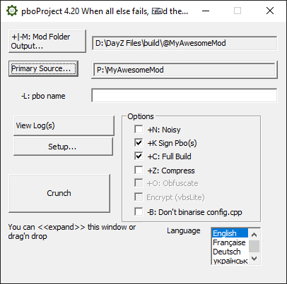

# [Basic](#basic)

This will be the basic skeleton for any mod for DayZ.

## [Download](#download)

1.  **Make sure [Dayz Tools](../start/dayztools.html) is running and the P:\\ drive is mounted.**
2.  **Make sure you did the initial configuration of [pboProject](../start/mikerostools.html#setting-pboproject-up)**
3.  [Download](https://github.com/SnackSBR/DayzModStructure/archive/refs/heads/main.zip) the mod skeleton from the [Github](https://github.com/SnackSBR/DayzModStructure)
4.  Extract it anywhere and copy the folder **MyAwesomeMod** to your **P:\\ drive**
5.  Rename all the folders named **MyAwesomeMod** to your mod name (don't use space in the name).
    *   You can also delete all the files name **.gitkeep**
6.  Open the file **config.cpp** with your favorite text editor.
7.  Rename all **MyAwesomeMod** with your mod name, the same you renamed all the folders.
8.  
9.  Click **+|-: Mod Folder Output...** and choose somewhere safe on your PC. This is where the packed mod will be placed.
10.  Click **Primary Source...** and select your renamed mod folder **inside your P:\\ drive**
11.  Click **Crunch**
12.  
13.  after a few seconds you should see the success text
14.  Go to the folder you chose when you clicked **+|-: Mod Folder Output...** and your packed mod will be there.
15.  
16.  
17.  