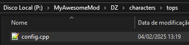
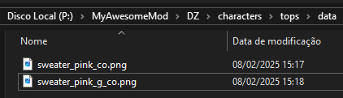
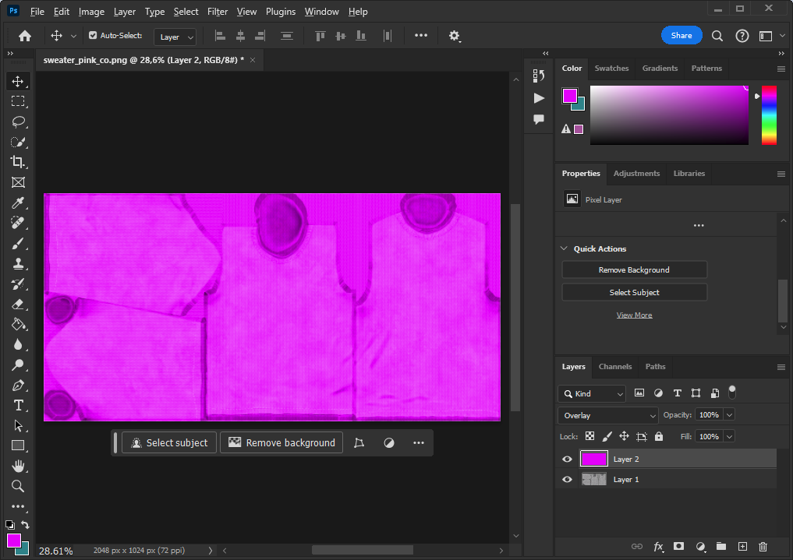
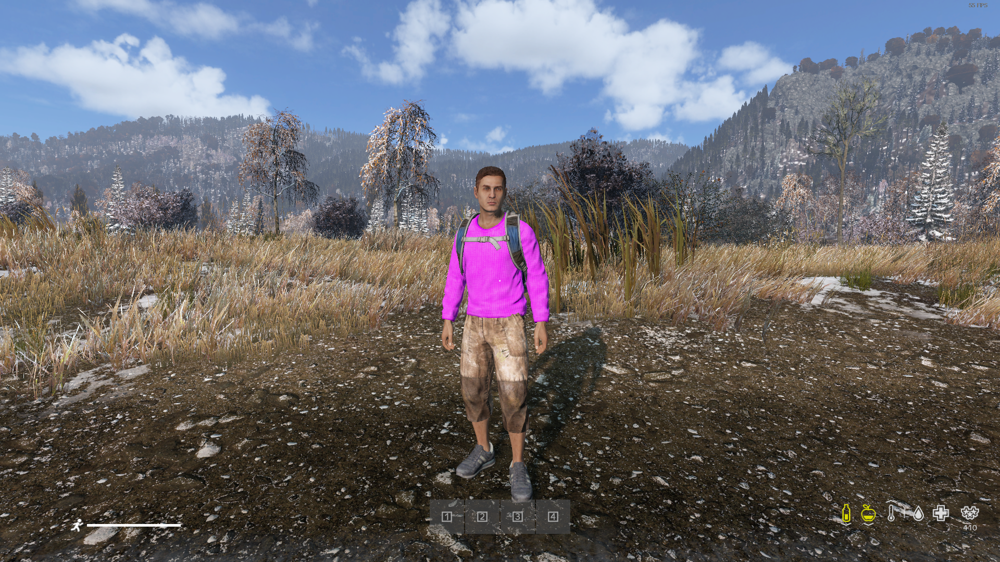

# [Retexture](#basic)

This tutorial will show you how to do a basic vanilla retextured item

1. **Make sure you completed the [Basic](../tutorials/basic.md) tutorial.**
1. Inside your folder mod create a folder where you will save your new item. I will be using the following structure **P:\MyAwesomeMod\DZ\characters\tops**, this folder structure follows the same path as vanilla but with the mod name at the start.
1. Create a file named **config.cpp** inside the folder you created.
1. 
1. Copy this content to your **config.cpp** and like the [Basic](../tutorials/basic.md) tutorial replace every **MyAwesomeMod** to your mod name
	*  ```c,ignore 
		class CfgPatches
		{
			class MyAwesomeMod_DZ_Characters_Tops
			{
				units[]={};
				weapons[]={};
				requiredVersion=0.1;
				requiredAddons[]={"DZ_Characters_Tops"};
			};
		};
		class CfgVehicles
		{
			class Sweater_ColorBase;
			
			class Sweater_Pink : Sweater_ColorBase
			{
				scope=2;
				visibilityModifier=0.85;
				hiddenSelectionsTextures[]=
				{
					"\MyAwesomeMod\dz\characters\tops\data\sweater_pink_g_co.paa", 
					"\MyAwesomeMod\dz\characters\tops\data\sweater_pink_co.paa", 
					"\MyAwesomeMod\dz\characters\tops\data\sweater_pink_co.paa"
				};
			};
		};
		```
1. **Sweater_Pink** is based in the vanilla **Sweater_Gray**
1. For the **CfgPatches** class name I'm using the same structure as the folder, I grab the vanilla class name and add the mod name before. The original config.cpp for the example can be found in **P:\DZ\characters\tops\data\config.cpp**
1. **Sweater_ColorBase** is a vanilla class for the base of all sweaters.
1. **Sweater_Pink** is the new item I'm creating.
1. For the texture I copied the vanilla ones (sweater_chalk_g_co.paa and sweater_chalkstone_co.paa) from P:\DZ\characters\tops\data to the folder **MyAwesomeMod\dz\characters\tops\data**, renamed them to the new color (in this case renamed chalk and chalkstone to pink);
1. 
1. To modify the texture I will open them using photoshop and just overlay a pink layer. You can change the textures to png using [Tex View](../start/dayztools.md#tex-view)
1. 
1. After modifying them, save as png and replace the ones in your mod folder.
1. The same way you converted the .paa texture to .png you can do the inverse using [Tex View](../start/dayztools.md#tex-view) or you can setup [Mikero's Tools](../start/mikerostools.md#setting-pboproject-up) to convert any .png to .paa.
1. Follow the steps in [Basic](../tutorials/basic.md#packing) and your mod will be ready to test.
1. 